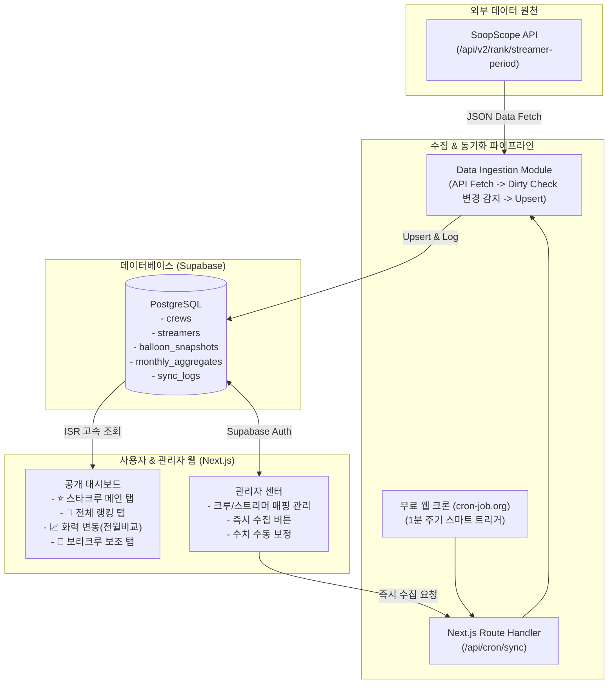

# 숲 스타크루 낙수표 (SOOP Star Crew Stats) 시스템 설계서

- **작성일**: 2026-10-03
- **상태**: 승인됨 (Approved)
- **작성 기준**: Next.js App Router + Supabase PostgreSQL + SoopScope REST API 수집 파이프라인

---

## 1. 개요 및 목적 (Overview & Goals)

본 프로젝트는 SOOP(구 아프리카TV)의 **스타크루(스타대학 및 스타크래프트 관련 크루)**를 메인으로 하여, 크루별 및 스트리머별 낙수 현황(별풍선 및 방송 시간 데이터)을 실시간으로 시각화하는 웹 대시보드 시스템이다.

### 핵심 목표
1. **메인 화면**: 숲 스타크루(스타대학) 중심의 크루별 카드 및 멤버 상세 리스트 제공
2. **스트리머별 필수 5대 핵심 지표**:
   - **프로필 사진**
   - **닉네임** (클릭 시 SOOP 방송국 바로가기)
   - **당월 누적 별풍선**
   - **방송시간** (시간 단위 환산 표시)
   - **시급** (시간당 별풍선 = `누적 별풍선 ÷ (누적 방송시간 분 / 60)`)
3. **크루별 종합 지표**:
   - 크루 전체 누적 별풍선 총합
   - 1인당 평균 화력 (크루 총 별풍선 ÷ 소속 스트리머 인원 수)
   - 크루별 총 방송시간 및 평균 시급
4. **준실시간 자동 수집**:
   - SoopScope API(`/api/v2/rank/streamer-period`)를 기반으로 **1분 주기** 스마트 백그라운드 자동 동기화 (cron-job.org / Webhook 연동, 변경 감지 적용)
5. **관리자(Admin) 제어 센터**:
   - SOOP ID 입력만으로 스트리머 추가 및 크루 배정 (API에서 닉네임/프로필 자동 조회)
   - 즉시 수집 트리거 및 수기 데이터 보정 기능

---

## 2. 전체 시스템 아키텍처 (Architecture)

---

## 3. 데이터베이스 스키마 설계 (Database Schema)

### 3.1. 테이블 구조 (PostgreSQL / Supabase)

#### `crews` (크루 정보)
| 컬럼명 | 타입 | 제약조건 | 설명 |
|---|---|---|---|
| `id` | UUID | PRIMARY KEY, DEFAULT gen_random_uuid() | 크루 고유 식별자 |
| `name` | TEXT | NOT NULL, UNIQUE | 크루명 (예: 바스포드, 철와대, 수니그룹 등) |
| `category` | TEXT | NOT NULL, DEFAULT 'star' | 분류 (`star`: 스타크루, `bora`: 보라크루, `other`: 기타) |
| `display_order` | INT | NOT NULL, DEFAULT 0 | 대시보드 카드 노출 우선순위 |
| `is_active` | BOOLEAN | NOT NULL, DEFAULT true | 활성화 및 노출 여부 |
| `created_at` | TIMESTAMPTZ | DEFAULT now() | 생성 시각 |

#### `streamers` (스트리머 정보)
| 컬럼명 | 타입 | 제약조건 | 설명 |
|---|---|---|---|
| `id` | UUID | PRIMARY KEY, DEFAULT gen_random_uuid() | 스트리머 고유 식별자 |
| `soop_id` | TEXT | NOT NULL, UNIQUE | SOOP 방송국 ID (SoopScope API 연동 키) |
| `nickname` | TEXT | NOT NULL | 스트리머 닉네임 |
| `profile_image_url`| TEXT | | 프로필 사진 URL |
| `crew_id` | UUID | REFERENCES crews(id) ON DELETE SET NULL | 소속 크루 ID (무소속 허용) |
| `is_active` | BOOLEAN | NOT NULL, DEFAULT true | 데이터 자동 수집 대상 여부 |
| `created_at` | TIMESTAMPTZ | DEFAULT now() | 등록 시각 |

#### `balloon_snapshots` (시계열 수집 스냅샷 - 1분 주기 스마트 수집)
| 컬럼명 | 타입 | 제약조건 | 설명 |
|---|---|---|---|
| `id` | BIGSERIAL | PRIMARY KEY | 스냅샷 일련번호 |
| `streamer_id` | UUID | REFERENCES streamers(id) ON DELETE CASCADE | 스트리머 ID |
| `total_stars` | INT | NOT NULL, DEFAULT 0 | 당월 누적 별풍선 개수 |
| `total_minutes` | INT | NOT NULL, DEFAULT 0 | 당월 누적 방송시간(분) |
| `hourly_stars` | INT | NOT NULL, DEFAULT 0 | 시간당 별풍선 (시급) |
| `recorded_at` | TIMESTAMPTZ | NOT NULL, DEFAULT now() | 수집 기록 시각 |

- **인덱스**: `CREATE INDEX idx_snapshots_streamer_time ON balloon_snapshots(streamer_id, recorded_at DESC);`

#### `monthly_aggregates` (월별 마감 및 대시보드 캐시 뷰/테이블)
| 컬럼명 | 타입 | 제약조건 | 설명 |
|---|---|---|---|
| `id` | UUID | PRIMARY KEY, DEFAULT gen_random_uuid() | 집계 레코드 ID |
| `streamer_id` | UUID | REFERENCES streamers(id) ON DELETE CASCADE | 스트리머 ID |
| `year_month` | TEXT | NOT NULL | 집계 기준 월 (예: `2026-10`) |
| `total_stars` | INT | NOT NULL, DEFAULT 0 | 최종 누적 별풍선 |
| `broadcast_hours` | NUMERIC(10,1) | NOT NULL, DEFAULT 0.0 | 총 방송시간 (시간 단위 소수점 1자리) |
| `hourly_stars` | INT | NOT NULL, DEFAULT 0 | 시급 (시간당 별풍선) |
| `prev_month_stars`| INT | DEFAULT 0 | 전월 누적 별풍선 (변동폭 비교용) |
| `diff_stars` | INT | DEFAULT 0 | 전월 대비 증감량 (▲ / ▼) |
| `updated_at` | TIMESTAMPTZ | DEFAULT now() | 갱신 시각 |

- **유니크 복합키**: `UNIQUE(streamer_id, year_month)`

#### `sync_logs` (동기화 실행 이력 로그)
| 컬럼명 | 타입 | 설명 |
|---|---|---|
| `id` | UUID | PRIMARY KEY |
| `triggered_by` | TEXT | 실행 주체 (`cron` 또는 `admin_manual`) |
| `status` | TEXT | 결과 (`success` 또는 `failed`) |
| `items_updated`| INT | 갱신된 스트리머 레코드 수 |
| `error_message`| TEXT | 실패 시 에러 내용 (성공 시 NULL) |
| `started_at` | TIMESTAMPTZ | 수집 시작 시각 |
| `completed_at` | TIMESTAMPTZ | 수집 완료 시각 |

---

## 4. 프론트엔드 대시보드 화면 및 기능 설계 (Frontend Design)

### 4.1. 메인 내비게이션 탭
1. **⭐ 스타크루 (기본 홈 화면, Default)**:
   - 스타크루(스타대학) 전용 낙수표 및 카드 그리드
2. **👑 전체 랭킹**:
   - 크루 소속에 관계없이 전체 스트리머 종합 별풍선 순위표 (Top 100) 및 크루별 1인당 생산성 랭킹
3. **📈 화력 변동 추이 (전월 비교분석)**:
   - 전월 동기 대비 증감량(▲ / ▼) 및 변화 게이지 차트
4. **🎪 보라크루 (보조 탭)**:
   - 보라크루 카테고리로 등록된 크루들의 낙수표 조회
5. **📁 월별 아카이브**:
   - 지난 달(`YYYY-MM`) 데이터 열람 기능

### 4.2. 스트리머 테이블 표시 필드 규격
각 크루 카드 내부의 멤버 목록은 사용자가 요청한 **5대 핵심 필드**로 간결하게 구성된다:
1. **순위 (`Rank`)**: 크루 내 별풍선 순위 (1위부터 오름차순)
2. **프로필 사진 (`Avatar`)**: 36x36 둥근 이미지 (fallback: 기본 아바타)
3. **닉네임 (`Nickname`)**: 텍스트 (클릭 시 `https://ch.sooplive.co.kr/{soop_id}` 새 탭 링크)
4. **누적 별풍선 (`Stars`)**: 세 자릿수 콤마 포맷팅 (예: `1,245,600개`)
5. **방송시간 (`Hours`)**: 시간 단위 환산 (예: `48.5시간`)
6. **시급 (`Hourly Rate`)**: 시간당 별풍선 수치 (예: `25,680개/h`)

### 4.3. 대시보드 상단 요약 바 (Hero Stats)
- **1위 스타크루**: 이번 달 누적 별풍선 최고 크루명 및 금액
- **1인당 최고 화력 크루**: 멤버 1인당 평균 별풍선 1위 크루명 및 금액
- **스타크루 전체 별풍선 누적**: 집계된 모든 스타크루의 별풍선 총합
- **실시간 동기화 상태 배지**: 🟢 최근 동기화 시각 및 [🔄 새로고침] 버튼

---

## 5. 관리자(Admin) 센터 사양

- **보안/인증**: Supabase Auth (관리자 계정 이메일/비밀번호 로그인)
- **크루 관리**:
  - 크루 추가, 크루명 수정, 표시 순서(`display_order`) 변경, 노출 토글
- **스트리머 관리**:
  - 새 스트리머 등록 시 `soop_id` 입력 → `SoopScope API`에서 닉네임과 프로필 사진을 즉시 조회하여 미리보기 제공 → 크루 선택 후 저장
  - 소속 크루 변경 및 수집 활성화/비활성화 토글
- **수동 동기화 제어**:
  - `[지금 즉시 수집]` 버튼: 클릭 시 `/api/cron/sync`를 트리거하여 진행 상황 및 결과(성공 인원수)를 토스트 알림으로 표시
- **수기 데이터 보정**:
  - 특정 스트리머의 당월 누적 별풍선 또는 방송시간 값을 직접 수정하여 오차 즉시 반영 가능

---

## 6. 에러 핸들링 및 안정성 설계 (Reliability)

1. **외부 API 호출 실패 시 (Fail-safe)**:
   - SoopScope API가 일시적으로 타임아웃되거나 에러를 반환해도 대시보드는 DB의 직전 최신 스냅샷을 그대로 서비스하여 서비스 무중단 보장
   - 실패 이력은 `sync_logs` 테이블에 자동 기록되어 관리자가 대시보드에서 파악 가능
2. **요청 헤더 보호**:
   - `User-Agent: Mozilla/5.0 ...` 및 `Referer: https://soopscope.com/` 헤더를 기본 탑재하여 API 차단 방지
3. **분모 0 처리 (Division by Zero 방지)**:
   - 방송시간이 0분인 경우 시급(`hourly_stars`)은 0으로 처리

---

## 7. 검증 및 테스트 계획 (Verification Plan)

1. **단위 테스트 (Unit Tests)**:
   - SoopScope API 응답 JSON 파서 검증
   - 시급 계산 공식 (`total_stars / (total_minutes / 60)`) 및 반올림 검증
   - 크루별 1인당 평균 화력 계산 공식 검증
2. **동기화 파이프라인 통합 테스트 (Integration Tests)**:
   - Mock API 응답을 통한 DB Upsert 및 스냅샷 기록 무결성 검증
   - API 에러 발생 시 fallback 처리 검증
3. **UI 렌더링 검증**:
   - 스타크루 탭, 랭킹 탭, 전월 변동 탭 정상 렌더링 확인
   - 스트리머 방송국 링크 새창 열림 검증

---

## 8. 배포 및 호스팅 (Deployment)

- **GitHub Repository**: `soop-naksoopyo` 계정에 `soop-star-naksoopyo` 저장소 생성
- **Vercel**: Next.js App Router 빌드 및 자동 배포
- **Supabase**: PostgreSQL DB 인스턴스 (무료 플랜)
- **스케줄러**: cron-job.org 웹 크론을 통한 1분 주기 엔드포인트 자동 호출 (변경 감지 적용)
